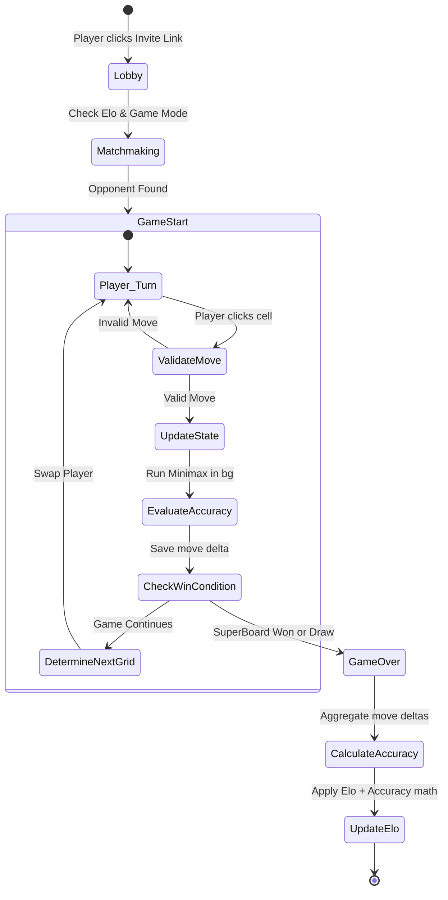

# Software Requirements Specification (SRS) & Architecture Blueprint
**Project:** Ultimate (Nested) Tic-Tac-Toe Multiplayer Network
**Phase:** Initial Architecture & Planning

## 1. System Overview
A real-time, web-based multiplayer Ultimate Tic-Tac-Toe game. Features include nested grid logic, Elo-based matchmaking, AI-driven accuracy scoring, dynamic UI theming, and real-time group chats.

## 2. Tech Stack
* **Frontend:** React.js (Component-based UI, Context API for dynamic themes)
* **Backend:** Node.js with Express.js (REST API, Game Logic)
* **Real-Time Engine:** Socket.io (WebSocket event handling)
* **Database:** MongoDB (NoSQL schema for scalable user profiles and match history)
* **Deployment (CI/CD):** GitHub Actions -> Vercel (Frontend) & Render/Heroku (Backend)

## 3. Game Mechanics & Features
* **Nested Board Logic:** A 9x9 grid divided into nine 3x3 SubBoards. A move in a SubBoard dictates the required SuperBoard grid for the opponent's next move.
* **Redirection Rule (Game Modes):** * *Autonomy Mode:* If sent to a full/won grid, the player can move anywhere.
  * *Random Mode:* If sent to a full/won grid, the system randomly selects the next grid.
* **Customization:** Players can equip custom markers (e.g., replacing 'X' or 'O' with a personal "Tick" icon) and swap UI themes (Retro Pixel vs. Neon Cyberpunk).
* **AI Accuracy Engine:** A background Minimax algorithm evaluates player moves against "perfect" play to calculate an accuracy percentage and adjust Elo distribution.

## 4. State Machine (Game Loop)

## 5. Database Schema (MongoDB Collections)

**Users Collection**
Stores profiles, Elo, custom marker preferences, and friends list.
```json
{
  "_id": "user_123",
  "username": "CodeMafiaBoss",
  "elo": 1200,
  "accuracy_avg": 85.4,
  "marker_theme": "custom_tick",
  "friends": ["user_456", "user_789"] 
}
```
### Matches Collection
Stores efficient, algebraic move arrays (e.g., `[44, 42, 28]`) to save space.
```json
{
  "_id": "match_999",
  "players": ["user_123", "user_456"],
  "status": "completed",
  "moves": [44, 42, 28, 80],
  "winner": "user_123"
}
```
### Chats Collection
For real-time lobby and group interactions.
```json
{
  "_id": "chat_555",
  "type": "group",
  "participants": ["user_123", "user_456"],
  "messages": [
    { "sender": "user_123", "text": "GLHF!", "timestamp": "2026-02-25T23:36:00Z" }
  ]
}
```
## 6. API Endpoints (REST)
* **Auth:** `POST /api/auth/register`, `POST /api/auth/login`
* **Users:** `GET /api/users/:username`, `PUT /api/users/customize`, `POST /api/users/friends/add`
* **Matches:** `GET /api/matches/history/:username`, `GET /api/leaderboard`
* **Tournaments:** `POST /api/tournaments/create`, `GET /api/tournaments/:id`

## 7. Real-Time Events (WebSockets)
* **Lobby:** `join_queue`, `match_found`
* **Game:** `make_move`, `game_state_update`, `offer_draw`, `accept_draw`, `resign`, `game_over`
* **Chat:** `send_message`, `receive_message`

## 8. Frontend Component Tree (React)
* `<App />` *(Theme Provider)*
  * `<NavBar />`
  * `<GameContainer />`
    * `<PlayerCard />` *(Opponent Elo & Accuracy)*
    * `<SuperBoard />`
      * `<SubBoard />` *(x9)*
        * `<Cell />` *(x9 - Renders custom SVG marker)*
        * `<GameControls />` *(Resign / Draw)*
      * `<Sidebar />`
        * `<MoveHistory />`
        * `<ChatBox />`

## 9. Version Control & Team Workflow
* **`main`:** Production code only.
* **`dev`:** Staging branch for integration testing.
* **`feature/*`:** Individual branches for new tasks (e.g., `feature/ai-heuristic` or `feature/custom-markers`).
* **Pull Requests:** Code must be reviewed and pass CI tests before merging to `dev`.