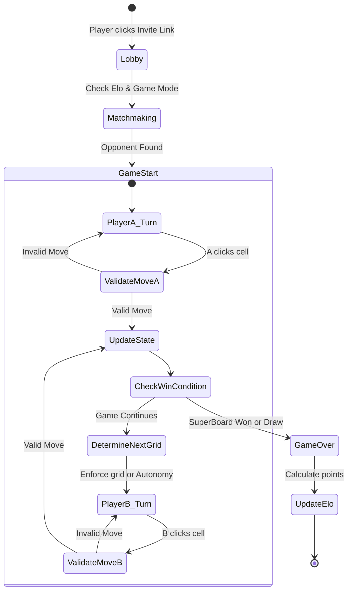

```mermaid
    stateDiagram-v2
        [*] --> Lobby: Player clicks Invite Link
        Lobby --> Matchmaking: Check Elo & Game Mode
        Matchmaking --> GameStart: Opponent Found
        
        state GameStart {
            [*] --> PlayerA_Turn
            
            PlayerA_Turn --> ValidateMoveA: A clicks cell
            ValidateMoveA --> PlayerA_Turn: Invalid Move
            ValidateMoveA --> UpdateState: Valid Move
            
            UpdateState --> CheckWinCondition
            
            CheckWinCondition --> DetermineNextGrid: Game Continues
            DetermineNextGrid --> PlayerB_Turn: Enforce grid or Autonomy
            
            PlayerB_Turn --> ValidateMoveB: B clicks cell
            ValidateMoveB --> PlayerB_Turn: Invalid Move
            ValidateMoveB --> UpdateState: Valid Move
        }
        
        CheckWinCondition --> GameOver: SuperBoard Won or Draw
        GameOver --> UpdateElo: Calculate points
        UpdateElo --> [*]
```